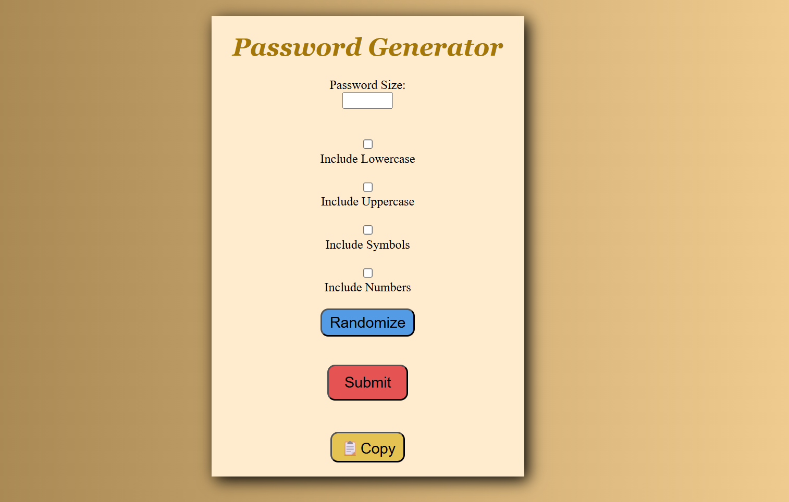

This is a password generator that uses a combination of JavaScript, HTML, and CSS styling to provide a simple experience that is needed in our technologically-advancing age.
## Example

# *HOW TO USE*
1. Use the number incremeneter to choose how long you want your password to be
2. Checkmark the boxes with what you want your password to have (capital or lowercase letters, symbols, and numbers)
3. Click `Submit` when you are ready to have your password generated
4. The desired password should be created below the `Submit` button
5. Copy the selected password and paste it wherever you need it

# ERRORS AND TO DO LIST
Below is a list of errors and problems that currently reside in the code, will be updated when supposed problems are fixed.
* Password limit set to `35` due to problems with fitting the password in completely inside the space
* Implement an error display in `script.js` when the user doesn't select any of the boxes to generate password 
